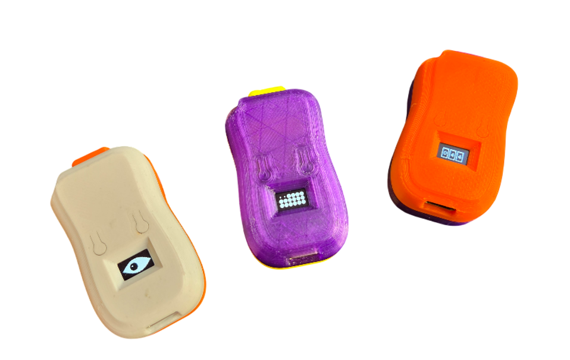
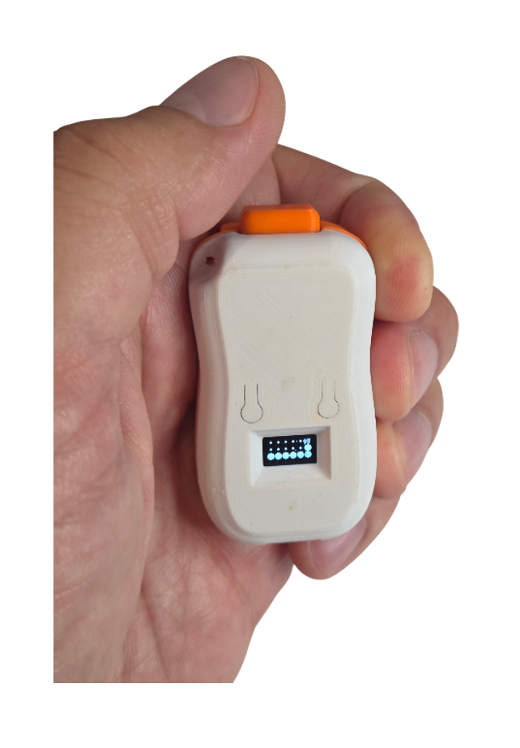

# ClickerBot — Антистресс-кликер
English version: **[README.md](README.md)**



Антистресс-кликер на **ESP32-C3**: крошечный OLED 72×40, тактильная кнопка, кнопки на плате (`BOOT` — меню и `RESET` — для прошивки), семь анимированных «скинов», статистика кликов по каждому скину, заряд аккумулятора с автоматическим deep sleep — плюс две локальные игры по **ESP-NOW** (без роутера и без интернета).


> **Готовый девайс** можно купить на сайте проекта — **[clickerbot.net](https://clickerbot.net/)**. Прошивка здесь — тот же код устройства без онлайн-лидерборда, поэтому собранный своими руками кликер работает полностью офлайн; заводской дополнительно синхронизирует клики туда.

В репозитории только **прошивка устройства**, и она полностью **офлайн**.
Нет аккаунта, нет синхронизации с сервером и нет провижининга: кроме экрана
настройки Wi-Fi, прошивка общается только с соседними кликерами по ESP-NOW.

---

## Возможности

- **7 скинов**, у каждого своя механика и свой постоянный счётчик кликов
  (хранится в NVS, переживает глубокий сон, перепрошивку и смену аккумулятора):

  | ключ | Скин | Механика | Ключи счётчиков |
  |---|---|---|---|
  | `eye` | Eye | моргает, щурится от частых кликов, трескается, взрывается, возрождается | `cntEye` |
  | `bubble` | Bubbles | пузырчатая плёнка: вдавливание и хлопок по очереди, затем новый лист | `cntBubbles` |
  | `cardio` | Cardio | линия ЭКГ и сердце, чей ритм зависит от темпа кликов | `cntCardio` |
  | `odometer` | Odometer | механический счётчик из трёх барабанов, прокрутка на каждый клик, сброс на 999 | `cntOdo` |
  | `bandit` | Bandit | слот-машина: барабаны крутятся, пока кликаешь, затем останавливаются по одному | `cntBandit` / `banditMatches` |
  | `duel` | Duel | перетягивание каната 1 на 1 по ESP-NOW, раунд 15 с | `cntDuel` / `duelWins` |
  | `koth` | KOTH | «Король холма» по ESP-NOW, до 12 игроков, раунд 60 с | `cntKoth` / `kothWins` |

  В меню есть ещё пункт **Random** — случайный одиночный скин при каждом
  пробуждении (командные скины исключены).

- **Экран статистики**: бегущая строка со счётчиками всех скинов, общий итог и
  заряд аккумулятора.
- **Локальная страница настройки** — её отдаёт само устройство, приложение не
  нужно: выбрать скин, задать ник, сканировать и подключить сети, посмотреть
  счётчики.
- **Контроль заряда** на делителе 47k/47k: процент на заставке, перечёркнутая
  батарея ниже 5 % и сразу глубокий сон — иначе ESP32 зацикливается на
  brownout-перезагрузках.
- **Энергосбережение**: 20 с без активности → минимальная картинка, ещё
  20 с → глубокий сон; пробуждение — клик по основной кнопке (с заставкой).
- **Экран «готов к прошивке»**: удержите кнопку меню (`BOOT`) 5 с, прежде чем
  нажать `RESET`, — так видно, когда чип можно прошивать.

## Железо

| Узел | Наименование |
|---|---|
| Микроконтроллер | ESP32-C3 0.42-Inch OLED White Light Display Development Board |
| Кнопка клика | Cherry MX Gateron Mechanical Keyboard |
| Контроллер заряда | TP4056 Lithium Battery Charger Module|
| Аккумулятор| Li-Pol 402030 200 мАч 3,7 В|
| Замер заряда | Резистивный делитель 47k/47k: средняя точка → `GPIO0` (ADC), низ делителя → `GPIO20` |

Схема сборки, монтажный чертеж, таблица подключения, схема делителя и электрические замечания:
**[docs/HARDWARE.ru.md](docs/HARDWARE.ru.md)**.

## Быстрый старт

**Прошить готовый образ** — из инструментов нужен только `esptool`: возьмите
[`firmware/clickerbot-2.1-diy-merged.bin`](firmware/clickerbot-2.1-diy-merged.bin)
и залейте его по адресу `0x0`:

```bash
esptool.py --chip esp32c3 --baud 460800 write_flash 0x0 clickerbot-2.1-diy-merged.bin
```

**Или собрать из исходников:**

1. Установите [PlatformIO](https://platformio.org/) (расширение для VS Code или
   `pip install platformio`).
2. Сборка и прошивка из корня репозитория:

   ```bash
   pio run -t upload
   ```

3. При желании: `pio device monitor -b 115200`, чтобы увидеть строку версии.

Готовый образ, инструкция для `esptool`, разметка flash и разбор проблем:
**[firmware/README.ru.md](firmware/README.ru.md)** и **[docs/BUILD.ru.md](docs/BUILD.ru.md)**.

## Игра
| Кнопка | Действие | Результат |
|---|---|---|
| Клик (`GPIO3`) | клик | взаимодействие со скином (хлопок, взрыв, прокрутка…) |
| Клик | удержание 3 с | экран статистики |
| Клик | удержание 1 с, в Duel / KOTH | вызов соперника / старт раунда |
| Клик | короткое отпускание, в Duel / KOTH | листание соперников / согласие |
| — | 20 с бездействия | минимальная картинка, затем глубокий сон |

## Управление
| Кнопка | Действие | Результат |
|---|---|---|
| Меню / `BOOT` (`GPIO9`) | удержание 1 с | вход в меню или подтверждение выбора и выход |
| Клик | удержание в меню | экран Wi-Fi |
| Меню / `BOOT` | удержание 5 с | экран «готов к прошивке» (дальше `BOOT` + `RESET`) |
| `RESET` | нажатие | перезагрузка; удержите `BOOT`, нажмите и отпустите `RESET`, затем отпустите `BOOT` — вход в режим прошивки |

На экране Wi-Fi клик переключает режим точки доступа и клиента.

## Экран настройки Wi-Fi
- **Точка доступа**: SSID `ClickerBot_XXXX` (последние два байта MAC), пароль
  WPA2 `12345678`, страница на `http://192.168.4.1`.
- **Клиент**: подключается к сохранённой сети и отдаёт ту же страницу по адресу
  от DHCP.
- Экран сам закрывается через 5 минут без активности, чтобы не тратить заряд.

## Структура проекта
```
src/
  main.cpp        режимы (скин / меню / статистика / Wi-Fi), setup и loop
  Config.h        пины и тайминги
  hal/            дисплей, кнопки, батарея, настройки в NVS, сон
  skins/          по классу на скин + SkinRegistry
  fx/             эффекты (трещины, осколки, искры) и счётчик хлопков
  menu/           меню скинов, статистика, экран Wi-Fi, экран прошивки
  duel/           транспорт ESP-NOW и протокол пакетов
  web/            минимальный HTTP-сервер для страницы настройки
  util/           мелкие помощники
```

## Как добавить скин

Реализуйте интерфейс `Skin` (`src/skins/Skin.h`) и добавьте одну строку в
`SkinRegistry.cpp`. Меню, экран статистики и веб-страница подхватят новый скин
сами — через `counterKey()` и `statsSubCounter()`.

## Грабли, которые стоит знать

- **Flash обязан работать на 40 МГц в режиме DIO.** На 80 МГц часть модулей
  ESP32-C3 с безымянной микросхемой flash (JEDEC-ID `0x464016`) запускается и
  работает, но молча не стирает и не пишет из приложения: ничего не сохраняется
  (NVS даже не может создать namespace). Это уже зафиксировано в `platformio.ini`.
- Разметка flash своя — один app-раздел 2,5 МБ, **без OTA** — поэтому берите
  `partitions.csv` из репозитория.
- Прошивка не стирает NVS: счётчики, ник и настройки Wi-Fi переживают обновление.
- Прошивка печатает одну строку с версией в UART0 при старте; на платах, где
  USB подключён к встроенному USB-Serial-JTAG, её видно только с
  `-D ARDUINO_USB_CDC_ON_BOOT=1`.
- Сборка из этого репозитория сообщает версию **`2.1-diy`** (та же строка лежит
  в `.bin` как `CLICKERFW:2.1-diy`), поэтому самостоятельно собранный кликер
  легко отличить от заводского, который сообщает `2.1`.

## Что вне этого репозитория

Онлайн-лидерборд, провижининг устройств и заводской флешер **не** публикуются.
Прошивка намеренно самодостаточна: собранное своими руками устройство работает
автономно. Лидерборд — и готовый собранный девайс — живут на сайте
проекта, **[clickerbot.net](https://clickerbot.net/)**.

## Лицензия

MIT — см. [LICENSE](LICENSE). Сторонний код не входит в репозиторий, но
прошивка использует [U8g2](https://github.com/olikraus/u8g2) (BSD-2-Clause) и
ядро Arduino ESP32.

Устройство — DIY-проект: собираете и используете на свой риск.
