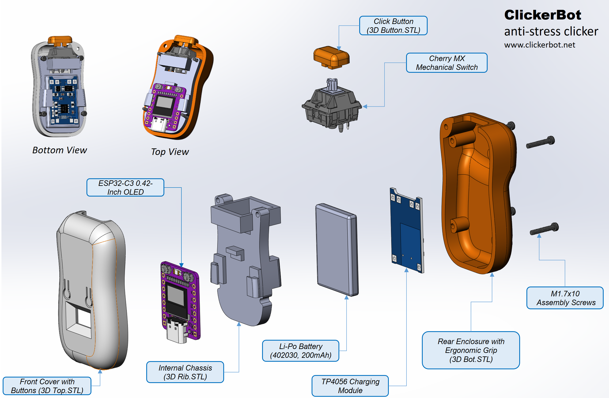
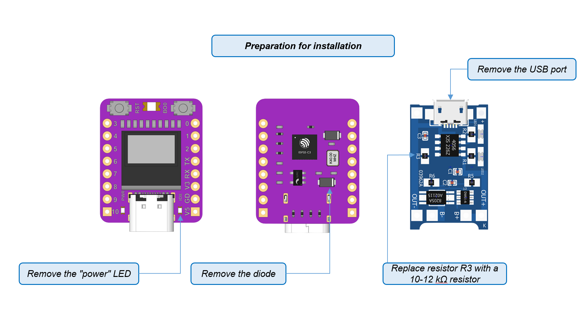
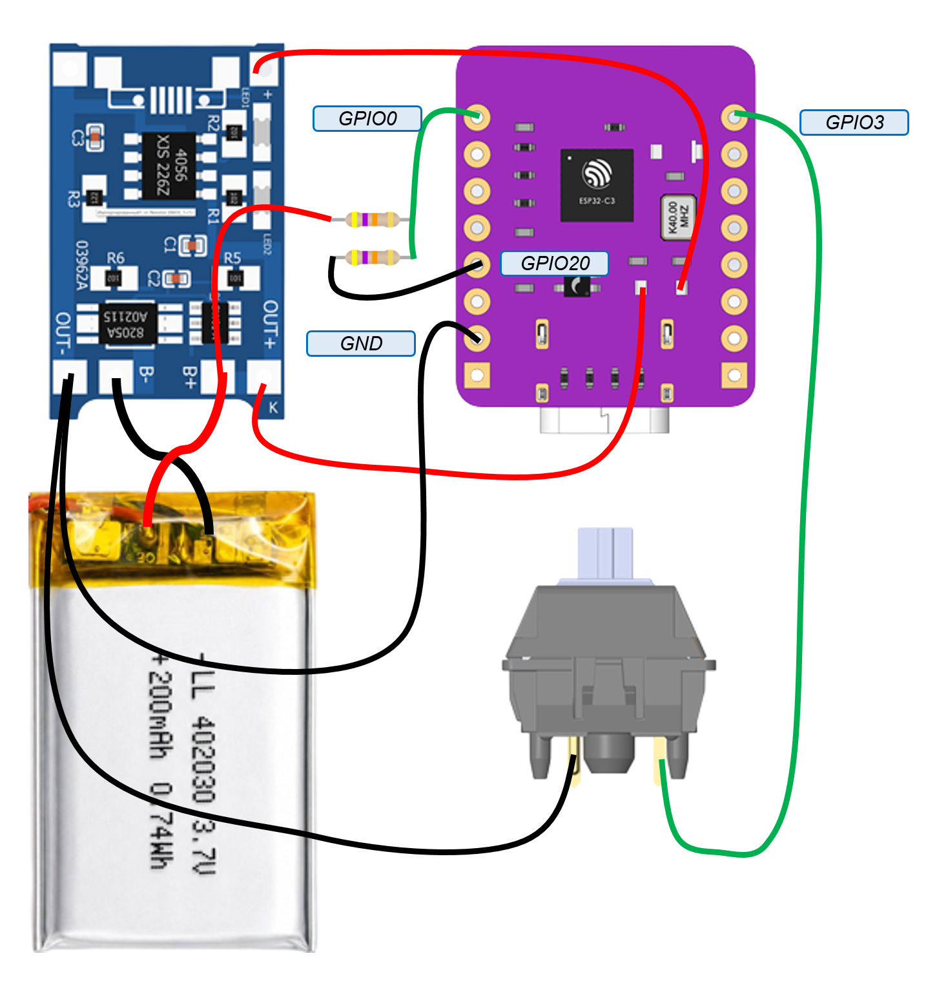
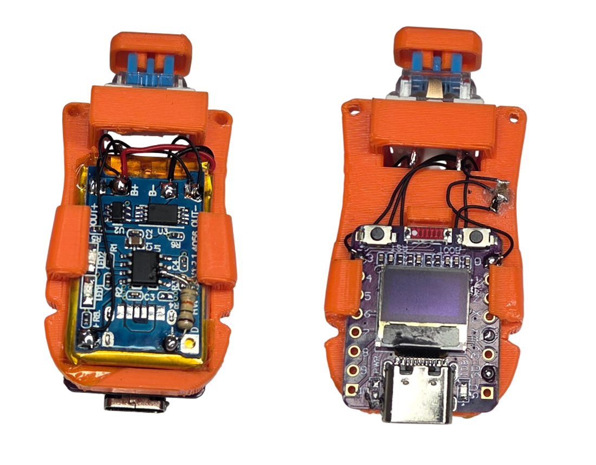

# Hardware
Русская версия: **[HARDWARE.ru.md](HARDWARE.ru.md)**

Wiring diagram, assembly diagram, pinout and electrical notes for the ClickerBot device. Everything here matches the constants in [`src/Config.h`](../src/Config.h).

The 3D-printable enclosure model files (STL) live here: [`STL`](../STL/)



## Parts

| Part | Item |
|---|---|
| Microcontroller | ESP32-C3 0.42-Inch OLED White Light Display Development Board |
| Click button | Cherry MX Gateron Mechanical Keyboard |
| Charge controller | TP4056 Lithium Battery Charger Module |
| Battery | Li-Pol 402030 200 mAh 3.7 V |
| Battery sense | 47k/47k resistor divider: mid-point → `GPIO0` (ADC), low side → `GPIO20` |



Before assembly, prepare the ESP32-C3 controller board and the battery charger board:
- On the ESP32-C3 board, remove the "Power" LED to extend the clicker's runtime on battery in deep sleep. On the back of the controller, remove the protection diode between the USB port and the 3.3 V converter. Solder the power wires in place of that diode, so the battery charges through the board's own USB port.
- On the charger board, remove the USB port. Replace resistor R3 with a 10–12 kΩ one, to suit a 200 mAh battery.



## Pinout

| GPIO | Direction | Purpose | Notes |
|---|---|---|---|
| `GPIO0` | ADC input | battery divider mid-point | `ADC1_CH0`, read once per wake-up |
| `GPIO3` | input, pull-up | main click button | also the deep-sleep wake source (`WAKE_PIN_MASK`) |
| `GPIO20` | output / high-Z | battery divider low side | grounded while measuring, released before deep sleep |

## Battery divider

```
        + battery (3.0 … 4.2 V)
             │
           [47k]
             │
   GPIO0 ────┤            mid-point = Vbat / 2  → keeps the ESP32-C3 ADC
             │            (≈0 … 2.5 V range) happy
           [47k]
             │
   GPIO20 ───┴─────────── low side, grounded while measuring
```

- With equal resistors the ADC sees exactly half of the battery voltage; the
  firmware multiplies by `BATT_DIVIDER = 2.0`.
- The divider draws only ~45 µA, and `Battery::sleepSafe()` puts `GPIO20` into a
  high-impedance state before deep sleep so it does not drain the cell.
- Thresholds (edit in `Config.h`): `BATT_FULL_MV = 4200`, `BATT_EMPTY_MV = 3300`,
  `BATT_CRITICAL_PERCENT = 5`. Below the critical level the device shows a
  crossed-out battery and goes to deep sleep immediately — near empty, the cell's
  voltage sag otherwise puts the ESP32 into a brownout reset loop.

> **`GPIO20` doubles as `U0RXD`** on the ESP32-C3. The firmware only ever writes
> to UART0 (the boot banner), and `Battery::begin()` drives the pin, so UART
> **receive** is not available. That is intentional: nothing listens on the
> serial port.

## Display

- The OLED is an I2C SSD1306 72×40 module, usually at address `0x3C`, driven by
  U8g2 over the hardware I2C bus at 400 kHz.
- If your module answers on `0x3D` instead, change the address in the U8g2 setup
  in `src/hal/DisplayManager.cpp`.
- The display's own controller is put to sleep (`setPowerSave(1)`) before the
  MCU enters deep sleep.

## Buttons

The device uses **three buttons**: one click button that you add, plus the two
buttons already on the board — `BOOT` (menu) and `RESET` (rebooting and flashing).
The click button and `BOOT` are active-low with the internal pull-up enabled in
`Button::begin()`; `RESET` is wired to the chip's reset line and is not read by
the firmware.

| Button | Pin | Behaviour in firmware |
|---|---|---|
| Click | `GPIO3` | skin interaction; hold 3 s → statistics; hold in the menu → Wi-Fi screen |
| Menu (`BOOT`) | `GPIO9` | hold 1 s → menu / confirm and exit; hold 5 s → "ready to flash" screen; click → leave the Wi-Fi screen |
| Reset | — | reboots the chip; hold `BOOT`, press and release `RESET`, then release `BOOT` to enter the download mode |

`GPIO3` is also the wake source: `WAKE_PIN_MASK = 1ULL << PIN_CLICK_BUTTON` with
`ESP_GPIO_WAKEUP_GPIO_LOW`, so a click brings the device out of deep sleep and
through `setup()` (which is where the battery is measured and the splash screen is
drawn).



## Flashing the chip

- Hold the menu (`BOOT`) button, press `RESET`, release `RESET`, then release
  `BOOT` — the standard ESP32-C3 download mode.
- The firmware helps here: holding the menu button for 5 s draws a static
  **"ready to flash"** screen, which stays in the OLED's video memory even after
  `RESET`, so you can see when the chip is about to be flashed.
- The flash chip must be clocked at 40 MHz in DIO mode — see
  [BUILD.md](BUILD.md#the-40-mhz--dio-rule).

## Power

- Battery is measured once per wake-up, not continuously.
- Idle handling: after 20 s without input the skin switches to its minimal
  picture; after another 20 s the MCU enters deep sleep. A click wakes it up.
- Multiplayer skins keep the radio off while idling (`DuelNet::end()`), so an
  idle device still does not drain the cell.
